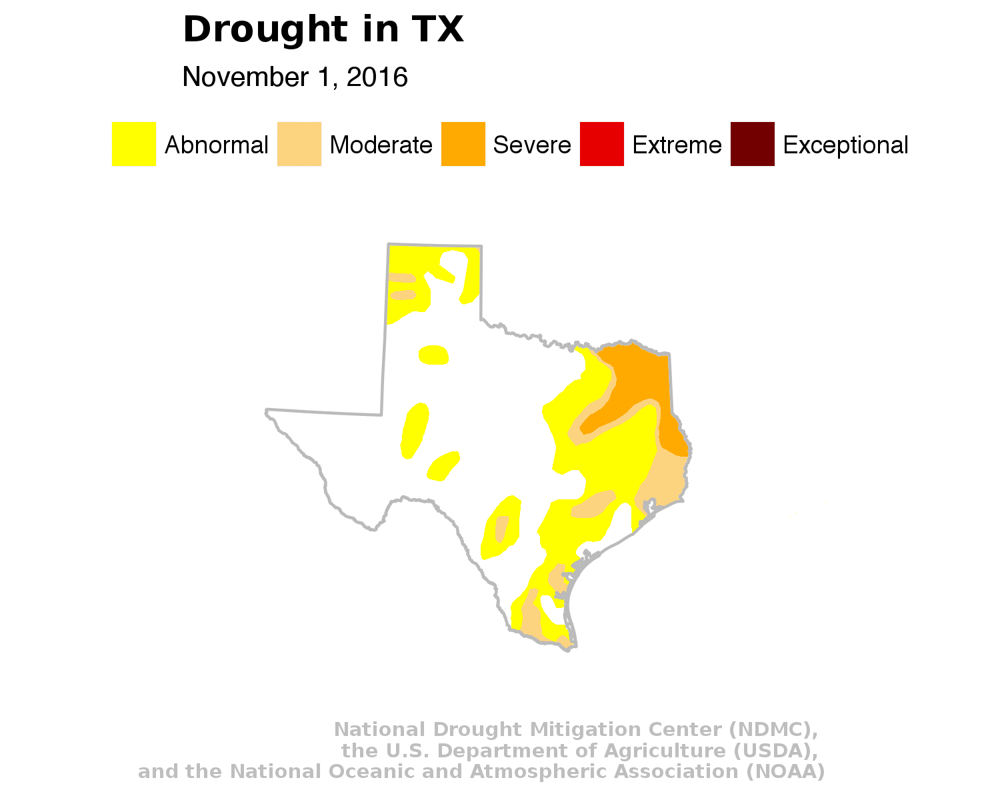

This tutorial is an introduction to working with spatial data in R, specifically through generating static maps programatically with shape files and creating GIFs. You'll be introduced to the basics of using R as a fast and powerful command-line Geographical Information System (GIS).

No prior knowledge is necessary to follow along, but an understanding of how pipes (%>%) and dplyr works will help.

**Other mapping tutorials**

* Mapping with Census data [[link](mapping-census-data.html)]
* Interactive maps with Leaflet in R [[link](leaflet-r.html)]

# Shapes and GIFs

We're going to map a year's worth of drought data from the [National Drought Mitigation Center](http://droughtmonitor.unl.edu/). And we'll turn it into a GIF.

We're going to work with shapefiles by importing them two different ways: via the [tigris](https://github.com/walkerke/tigris) package and via importing from [raw shapefiles](http://droughtmonitor.unl.edu/MapsAndData/GISData.aspx), which is how NDMC archives their data.


```{r loading, warning=F, message=F}
library(tigris)
library(tidyverse)
library(lubridate)
usmap <- states(cb=T)
# plot(usmap)
usfort <- fortify(usmap, region="STUSPS")
```

We'll generate a couple types of maps: National and a state you specify.

First, let's start national.

# Bringing in the data

This is how the data is listed on the [National Drought Mitigation Center](http://droughtmonitor.unl.edu/) site.


But I've done the hard work and downloaded and unzipped the files into your `shapes` directory.


# Mapping the shapefile I

Let's bring in the first folder `USDM_2016_0105_M`.

```{r shape1, fig.width=8, fig.height=5, warning=F, message=F}
library(rgdal)
# For readOGR to work, we'll need to know the folder where the shape file is
# And we also need to know the name of the shapefiles

droughtmap <- readOGR(dsn="shapes/USDM_20160105_M", layer="USDM_20160105")

# Transform the shapefile into a dataframe so we can work with it in R
droughtfort <- fortify(droughtmap, region="DM")

gg <- ggplot() 

# This line will bring in the drought shapefile
gg <- gg +  geom_polygon(data = droughtfort, aes(x=long, y=lat, group=group, fill=id), color = "black", size=0) 
gg
```

Well, it's a far cry from what the map looks like on the official website.


It's got the chart background, there are no borders for the states, and the colors don't match the yellow-to-brown color scheme.

But that's because this is just the default result without any tweaks to the style.

Let's do that now and also bring in the state borders we brought in earlier with the tigris package.

# Mapping the shapefile II
```{r us_map, fig.width=8, fig.height=5, warning=F, message=F}
 gg <- ggplot() 

  # This line will bring in the drought shapefile
  gg <- gg +  geom_polygon(data = droughtfort, aes(x=long, y=lat, group=group, fill=id), color = "black", size=0) 

  # This line brings in the US borders as a layer
  gg <- gg +  geom_polygon(data = usfort, aes(x=long, y=lat, group=group, fill=total), color = "gray73", fill=NA, size=0.2) 

  # This sets the boundaries of the view so it excludes Alaska and Hawaii
  gg <- gg +  coord_map("polyconic", xlim=c(-125, -70), ylim=c(25.5, 48.5)) 

  # This line sets the colors and text for the legend items
  gg <- gg +  scale_fill_manual(name="", values = c("#FFFF00", "#FCD37F", "#FFAA00", "#E60000", "#730000"),
                                labels = c("Abnormal", "Moderate", "Severe", "Extreme", "Exceptional"))

  # The rest of the code in this chunk is for blurbs and style.
  gg <- gg + labs(x=NULL, y=NULL, 
                  title="Drought in the U.S.",
                  # The date is from the file name itself
                  subtitle="January 5, 2016",
                  caption="National Drought Mitigation Center (NDMC), \nthe U.S. Department of Agriculture (USDA), \n and the National Oceanic and Atmospheric Association (NOAA)")
  gg <- gg + theme(plot.title=element_text(face="bold", family="Lato Regular", size=13))
  gg <- gg + theme(plot.caption=element_text(face="bold", family="Lato Regular", size=7, color="gray", margin=margin(t=10, r=80)))
  gg <- gg + theme(legend.position="top")
  gg <- gg + theme(axis.line =  element_blank(),
                   axis.text =  element_blank(),
                   axis.ticks =  element_blank(),
                   panel.grid.major = element_blank(),
                   panel.grid.minor = element_blank(),
                   panel.border = element_blank(),
                   panel.background = element_blank()) 
print(gg)
```

**Now we're talking.**

# Loop to create all the maps

We have the folders and we have the time information in the file names.

Let's write a loop that will generate images for each drought shapefile in the folder.

### What this loop does

1. Goes through every single folder in the 'shapes' folder
2. Imports the shapefile for that week
3. Places the U.S. drought shapefile
4. Then places the U.S. borders on top of it
5. Saves the image into the us_maps folder

```{r us_loop, fig.width=8, results="hide", warning=F, message=F}
# This will create a folder called "us_maps" to store the png files created

the_path <- getwd()
ifelse(!dir.exists(file.path(the_path, "us_maps")), dir.create(file.path(the_path, "us_maps")), FALSE)

# Compiling a list of the folders in the 'shapes' folder
shape_list <- list.files("shapes")

for (i in 1:length(shape_list)) {
  
  file_name <- shape_list[i]
  dsn_name <- paste0("shapes/", file_name)
  layer_name <- gsub("_M", "", file_name)
  the_date <- gsub("USDM_", "", layer_name)
  the_date <- ymd(the_date)
  ap_date <- paste0(month(the_date, label=T, abbr=F), " ", day(the_date), ", ", year(the_date))
  droughtmap <- readOGR(dsn=dsn_name, layer=layer_name)
  droughtfort <- fortify(droughtmap, region="DM")
  
  gg <- ggplot() 
  gg <- gg +  geom_polygon(data = droughtfort, aes(x=long, y=lat, group=group, fill=id), color = "black", size=0) 
  gg <- gg +  geom_polygon(data = usfort, aes(x=long, y=lat, group=group, fill=total), color = "gray73", fill=NA, size=0.2) 
  gg <- gg +  coord_map("polyconic", xlim=c(-125, -70), ylim=c(25.5, 48.5)) 
  gg <- gg +  scale_fill_manual(name="", values = c("#FFFF00", "#FCD37F", "#FFAA00", "#E60000", "#730000"),
                                labels = c("Abnormal", "Moderate", "Severe", "Extreme", "Exceptional"))
  gg <- gg + labs(x=NULL, y=NULL, 
                  title="Drought in the U.S.",
                  subtitle=ap_date,
                  caption="National Drought Mitigation Center (NDMC), \nthe U.S. Department of Agriculture (USDA), \n and the National Oceanic and Atmospheric Association (NOAA)")
  gg <- gg + theme(plot.title=element_text(face="bold", family="Lato Regular", size=13))
  gg <- gg + theme(plot.caption=element_text(face="bold", family="Lato Regular", size=7, color="gray", margin=margin(t=10, r=80)))
  gg <- gg + theme(legend.position="top")
  gg <- gg + theme(axis.line =  element_blank(),
                   axis.text =  element_blank(),
                   axis.ticks =  element_blank(),
                   panel.grid.major = element_blank(),
                   panel.grid.minor = element_blank(),
                   panel.border = element_blank(),
                   panel.background = element_blank()) 
  gg
  file_path <- paste0("us_maps/", layer_name, ".png")
  ggsave(gg, file=file_path, width=5, height=4, type="cairo-png")
  
  
}
```

Congratulations. You've got a folder full of maps.


You have enough to make small multiples of the maps in a story.

If you want, you can alter the code above and leave out the titles and dates if you'd like to create that in CSS. 

# Make a GIF of all the images

We'll use the [`imagemagick`](https://ropensci.org/blog/blog/2016/08/23/z-magick-release) package.


```{r gif_us, fig.width=8, fig.height=5, warning=F, message=F}
library(magick)

# Create a list of the png file names in the us_maps folder
the_list <- paste0("us_maps/", list.files("us_maps/"))

# apply the image_read function to each of the files and store it as a list in frames
frames <- lapply(the_list, image_read)

# use the image_animate function, which creates a GIF out of the list of images
animation <- image_animate(image_join(frames), fps=4)

# Print the animation
# print(animation)

# Save the image as us_map.gif
image_write(animation,"us_map.gif")

```


Ready to focus on one state?

It's easy.

# Mapping state drought

Just change the abbreviation in the code below and the bounding box later further on.

```{r prep_shapes, warning=F, message=F}
# NOTE: YOU CAN CREATE STATE-SPECIFIC MAPS FOR YOUR STATE IF YOU SUB OUT "TX" 
# AND THEN CHANGE THE BOUNDING BOX LATITUDES AND LONGITUDES (XLIM AND YLIM IN COORD_MAP)

state_abbrev <- "TX"

# Creating a shapefile specifically for Connecticut
state_fort <- filter(usfort, id==state_abbrev)

# Creating a shapefile of all state shapes minus Connecticut
not_state_fort <- filter(usfort, id!=state_abbrev)

# Compiling a list of the folders in the 'shapes' folder
shape_list <- list.files("shapes")
```

### Now the loop

Follow the notes in the code so you know where to change boundaries of the map

```{r state_loop, results="hide", warning=F, message=F}

ifelse(!dir.exists(file.path(the_path, paste0(state_abbrev, "_maps"))), dir.create(file.path(the_path, paste0(state_abbrev, "_maps"))), FALSE)

for (i in 1:length(shape_list)) {

  file_name <- shape_list[i]
  dsn_name <- paste0("shapes/", file_name)
  layer_name <- gsub("_M", "", file_name)
  the_date <- gsub("USDM_", "", layer_name)
  the_date <- ymd(the_date)
  ap_date <- paste0(month(the_date, label=T, abbr=F), " ", day(the_date), ", ", year(the_date))
  droughtmap <- readOGR(dsn=dsn_name, layer=layer_name)
  droughtfort <- fortify(droughtmap, region="DM")
  
  
  gg <- ggplot() 
  gg <- gg +  geom_polygon(data = droughtfort, aes(x=long, y=lat, group=group, fill=id), color = NA, size=0.5) 
  gg <- gg +  geom_polygon(data = not_state_fort, aes(x=long, y=lat, group=group, fill=total), color = "white", fill="white", size=.5) 
  gg <- gg +  geom_polygon(data = state_fort, aes(x=long, y=lat, group=group, fill=total), color = "gray73", fill=NA, size=0.5) 
  
  # OK, replace the line below with the bounding box
  # For example, the northeast lat and lon around Texas is 36.942330, -108.602890
  # And the southeast lat and lon for Texas is 24.911878, -89.930472
  # Therefore, xlim=c(-108.602890, -89.930472), ylim=c(24.911878, 36.942330)
  gg <- gg +  coord_map("polyconic", xlim=c(-108.602890, -89.930472), ylim=c(24.911878, 36.942330)) 
  gg <- gg +  scale_fill_manual(name="", values = c("#FFFF00", "#FCD37F", "#FFAA00", "#E60000", "#730000"),
                                labels = c("Abnormal", "Moderate", "Severe", "Extreme", "Exceptional"))
  gg <- gg + labs(x=NULL, y=NULL, 
                  title=paste0("Drought in ", state_abbrev),
                  subtitle=ap_date,
                  caption="National Drought Mitigation Center (NDMC), \nthe U.S. Department of Agriculture (USDA), \n and the National Oceanic and Atmospheric Association (NOAA)")
  gg <- gg + theme(plot.title=element_text(face="bold", family="Lato Regular", size=13))
  gg <- gg + theme(plot.caption=element_text(face="bold", family="Lato Regular", size=7, color="gray", margin=margin(t=10, r=80)))
  gg <- gg + theme(legend.position="top")
  gg <- gg + theme(axis.line =  element_blank(),
                   axis.text =  element_blank(),
                   axis.ticks =  element_blank(),
                   panel.grid.major = element_blank(),
                   panel.grid.minor = element_blank(),
                   panel.border = element_blank(),
                   panel.background = element_blank()) 
  gg
  
  file_path <- paste0(state_abbrev, "_maps/", layer_name, ".png")
  ggsave(gg, file=file_path, width=5, height=4, type="cairo-png")
}

```

# Final state GIF

```{r state_gif, warning=F, message=F}

the_list <- paste0(paste0(state_abbrev,"_maps/"), list.files(paste0(state_abbrev,"_maps/")))

frames <- lapply(the_list, image_read)
animation <- image_animate(image_join(frames), fps=4)
image_write(animation, paste0(state_abbrev, "_map.gif"))
```

